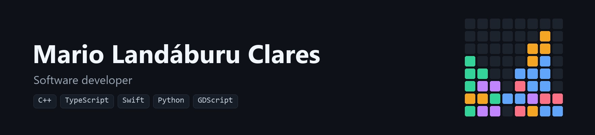
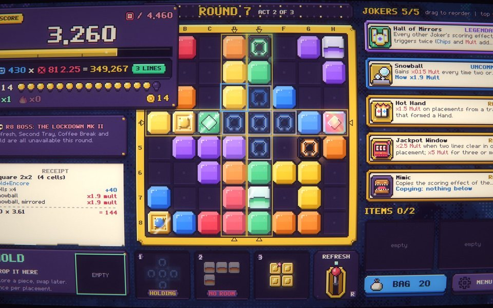
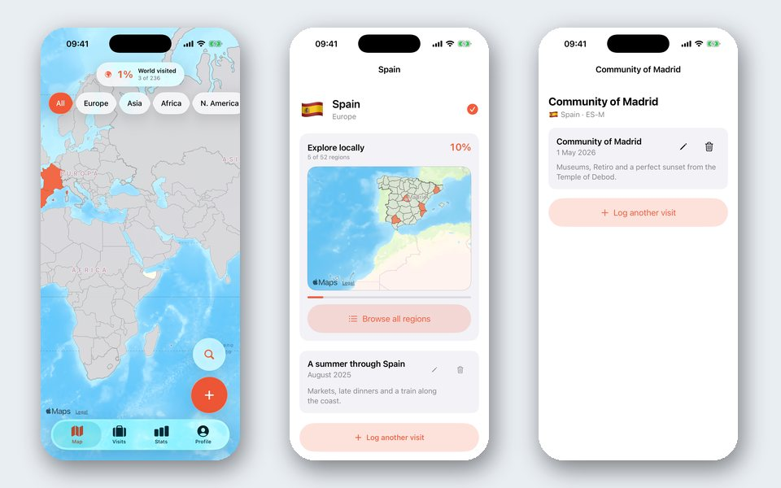
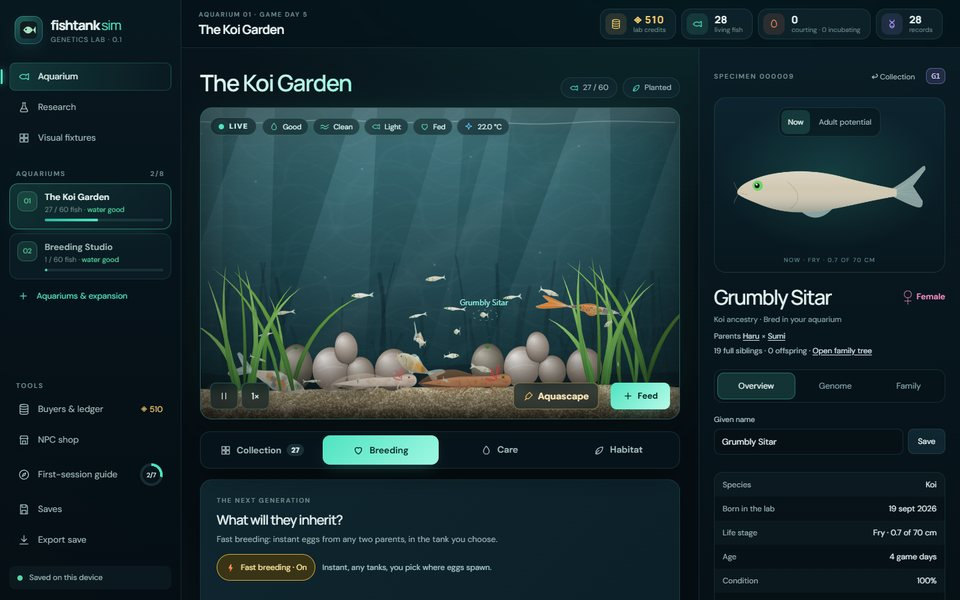
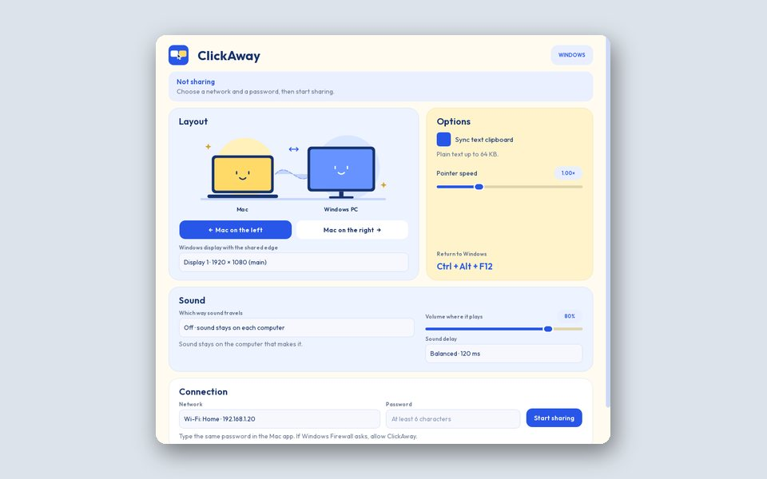
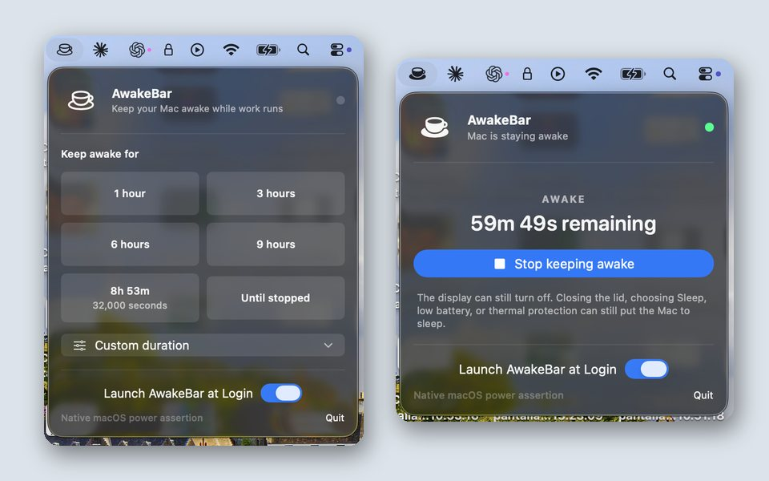
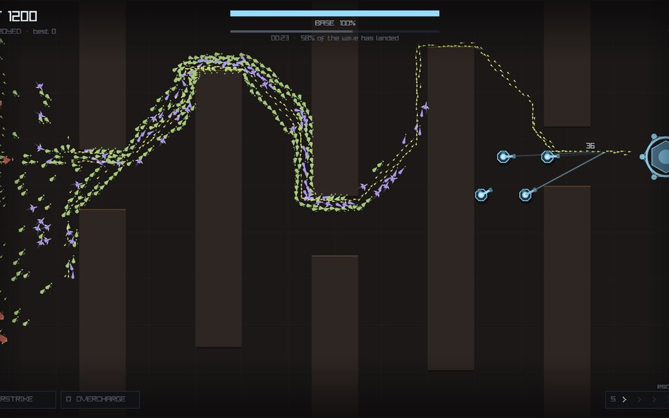

<a href="https://www.linkedin.com/in/mario-landaburu/">LinkedIn</a> · <a href="mailto:mariolandaburuclares@gmail.com">Email</a>

## Selected work

<table>
<tr>
<td width="50%"></td>
<td width="50%">
<h3><a href="https://github.com/ElMariones/blockmania-demo">BLOCKMANIA</a></h3>

Roguelike block puzzle: an 8×8 board, 92 rule-bending Jokers, bosses and a Chips × Mult scoring engine. Every sprite, font, sound and music track is generated from code.

<ul><li>Free demo out for Windows, macOS and Linux</li><li>Deterministic, seeded rules layer; every score itemized on a receipt</li><li>11 languages, full controller support</li></ul>

<code>Godot 4</code> <code>GDScript</code> <code>Python</code> <code>Shaders</code>

<a href="https://github.com/ElMariones/blockmania-demo/releases/latest"><b>Play the demo</b></a> · <a href="https://github.com/ElMariones/blockmania-demo">Source</a>

</td>
</tr>
<tr>
<td width="50%">
<h3><a href="https://github.com/ElMariones/travelmap">TravelMap</a></h3>

iOS travel log: 236 countries and 4,477 offline subdivisions on MapKit, a visit timeline, and home and lock screen widgets.

<ul><li>Natural Earth borders, bundled and pre-simplified for offline use</li><li>Home and lock screen widgets in six sizes</li><li>Supabase sync with Sign in with Apple</li></ul>

<code>Swift</code> <code>SwiftUI</code> <code>MapKit</code> <code>Supabase</code>

<a href="https://github.com/ElMariones/travelmap">Source</a>

</td>
<td width="50%"></td>
</tr>
<tr>
<td width="50%"></td>
<td width="50%">
<h3><a href="https://github.com/ElMariones/fishtank-sim">Fishtank Sim</a></h3>

Aquarium genetics sandbox. Koi and axolotls carry 66-locus synthetic genomes with crossover and mutation; each animal is drawn from its genes and tracked across six-generation pedigrees.

<ul><li>Procedural anatomy drawn from each genome</li><li>Seeded RNG streams: every cross replays exactly</li><li>Simulation in a Web Worker, saves in IndexedDB</li></ul>

<code>TypeScript</code> <code>React 19</code> <code>Canvas 2D</code> <code>Web Workers</code>

<a href="https://fishtank-sim.vercel.app"><b>Open</b></a> · <a href="https://github.com/ElMariones/fishtank-sim">Source</a>

</td>
</tr>
<tr>
<td width="50%">
<h3><a href="https://github.com/ElMariones/ClickAway">ClickAway</a></h3>

Use one mouse, clipboard and audio across a Windows PC and a Mac over the local network, paired with SPAKE2 inside TLS.

<ul><li>Password never crosses the network (SPAKE2 in TLS)</li><li>Audio mixed both ways without delaying the pointer</li></ul>

<code>Python</code> <code>TLS</code> <code>SPAKE2</code>

<a href="https://github.com/ElMariones/ClickAway">Source</a>

</td>
<td width="50%">
<h3><a href="https://github.com/ElMariones/AwakeBar">AwakeBar</a></h3>

macOS menu-bar app that keeps the Mac awake with an in-process IOKit power assertion: no Terminal, no caffeinate child process.

<ul><li>IOKit assertion tied to the app&#x27;s lifetime</li><li>Launch at Login through SMAppService</li></ul>

<code>Swift</code> <code>IOKit</code>

<a href="https://github.com/ElMariones/AwakeBar">Source</a>

</td>
</tr>
<tr>
<td width="50%">
<h3><a href="https://github.com/ElMariones/last-stand">LAST STAND</a></h3>

Incremental tower defense built to simulate tens of thousands of agents at 120 fps on a single core. No asset files: every visual is geometry and every sound is synthesised at launch.

<ul><li>Flow-field horde pathing, no scripted waves</li><li>Zero asset files: geometry and synthesised audio</li><li>320 doctest cases, warnings as errors</li></ul>

<code>C++20</code> <code>raylib</code> <code>CMake</code> <code>doctest</code>

<a href="https://github.com/ElMariones/last-stand">Source</a>

</td>
<td width="50%"></td>
</tr>
</table>

## More projects

| Project | About | Built with |
|:--|:--|:--|
| **[All In: La Última Mano](https://github.com/ElMariones/PokerInfinito)** [Play](https://elmariones.github.io/PokerInfinito/) | Pixel-art 2D card-battle RPG: walk the town, beat each bar's champion in poker-hand duels, reach the casino. | `JavaScript` `Phaser` |
| **[Brood & Burrow](https://github.com/ElMariones/goblin-clicker)** [Play](https://goblin-clicker.vercel.app) | Goblin incremental game with two production economies running at once, research trees, expeditions and stacked prestige layers, in a CRT terminal look. | `TypeScript` `React 19` `Vite` `Three.js` |
| **[PokeCard Simulator](https://github.com/ElMariones/pokemon-card-sim)** [Open](https://pokemon-card-sim-six.vercel.app) | Pokémon TCG collection sim with seeded pack odds, an NPC market with negotiation, grading, arcade minigames and a server-settled economy. No real money. | `Next.js 16` `PostgreSQL` `Drizzle` `Vitest` |
| **[Ant Farm Sim](https://github.com/ElMariones/ant-farm-sim)** | Deterministic ant-colony game: ants choose work from colony needs, dig connected tunnels, raise brood, and a mature colony founds the next one through a nuptial flight. | `C++20` `raylib` `EnTT` `Catch2` |
| **[Football Draft](https://github.com/ElMariones/football-draft)** [Open](https://football-draft-liard.vercel.app) | Spin for a club and an era, draft an XI from football history, simulate a full season with a Poisson match model and read an AI-written verdict. | `Next.js` `Zustand` `Postgres` `OpenAI` |
| **[PokeLambda](https://github.com/ElMariones/poke-lambda)** [Open](https://elmariones.github.io/poke-lambda/) | Pokémon reference and team builder: 1,351 Pokémon, 919 moves, a type lab, team weakness matrix and six quiz modes over a static dataset built from PokéAPI. | `React` `TypeScript` `Zustand` `Vitest` |
| **[TradeBOT](https://github.com/ElMariones/papermarket-tradebot)** | Paper-trading platform for Polymarket. Bots trade a quantified strategy against live order books with simulated fills; an on-device LLM answers questions about every decision. | `Python` `SQLite` `Vanilla JS` `MLX` |
| **[Landownload](https://github.com/ElMariones/Landownload)** [Open](https://elmariones.github.io/Landownload/) | Self-hosted media downloader. The site runs on GitHub Pages; the downloads run on your own PC through yt-dlp and FFmpeg, reached over Tailscale. | `React` `FastAPI` `yt-dlp` `Docker` |
| **[SPLICE](https://github.com/ElMariones/SPLICE)** [Open](https://elmariones.github.io/SPLICE/) | Video splitter that runs in the browser: mark in and out points, cut the batch with ffmpeg compiled to WebAssembly. Nothing is uploaded. | `JavaScript` `ffmpeg.wasm` |
| **[Random Animal Generator](https://github.com/ElMariones/random_animal_gen)** [Open](https://random-animal-gen.vercel.app) | Rolls a creature part by part from hundreds of real animals, with a community gallery of drawings. | `JavaScript` |

## Stack

<table>
<tr><td><b>LANGUAGES</b></td><td>     </td></tr>
<tr><td><b>ENGINES &amp; GRAPHICS</b></td><td>     </td></tr>
<tr><td><b>WEB</b></td><td>     </td></tr>
<tr><td><b>DATA &amp; BACKEND</b></td><td>    </td></tr>
<tr><td><b>NATIVE</b></td><td>   </td></tr>
<tr><td><b>TEST &amp; SHIP</b></td><td>      </td></tr>
</table>
